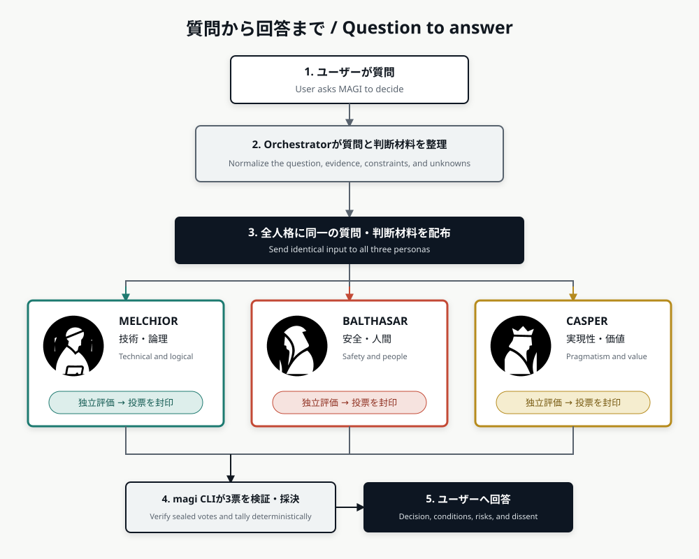

# MAGI Council Agent Skill

[Japanese](README.md) | English

MAGI Council is an Agent Skill template that asks three separated subagent contexts to evaluate a proposal and produces a final decision from their votes.

Each agent votes without seeing the other agents' responses. Hooks temporarily seal the votes, and once all three votes are available, a single Rust binary applies deterministic tallying rules.

This is more than asking an AI to "think as three personas." It emphasizes context and vote separation, deterministic tallying, and auditable records.

## Guarantees and Known Limitations

- Supported Hosts separate subagent contexts and vote information. MAGI Council does not automatically provide different providers, foundation models, processes, or OS identities. Three personas using the same or similar model can make correlated mistakes.
- Majority voting deterministically maps the recorded votes to a result; it does not prove correctness or safety. `approved` means the configured process retained no blocking evidence for this input.
- Confidence is self-reported and uncalibrated. A value of 80 is not an 80% correctness probability.
- SHA-256 and the manifest detect ordinary missing or modified records while the CLI, Hooks, and manifest remain trusted. They do not stop a same-user or administrator attacker from replacing both an artifact and its hash, and they are not signatures or creator proof.
- The recorded input, protocol/schema, deterministic rules, result, and audit procedure are reproducible. Model output is not guaranteed to be identical across reruns because providers, model versions, sampling, context, and tools can change.
- `sealed-subagents` logical separation exists only when the Host actually provides Custom Agents/Subagents, every required Hook, and vote-body confidentiality. `inline` provides neither a secret ballot nor an independent-context guarantee.

See the canonical [Threat Model](docs/THREAT_MODEL.md) for attackers, CLI/Hook/Host/file-system/administrator trust boundaries, prevention and detection limits, and high-assurance deployment guidance.

## From Question to Answer



Every persona receives the same question and decision evidence. Persona state and conversation history are not shared or transferred. Each persona evaluates the input in an isolated context, then the `magi` CLI tallies the sealed votes.

[draw.io source](docs/diagrams/magi-question-flow.drawio)

## Why This Skill Exists

A normal chat can simulate multiple perspectives, but using several personas within one conversation has limitations as a decision-making process:

* Later personas can be influenced by earlier responses.
* It is difficult to verify whether each persona judged independently.
* An AI-generated summary can disagree with the actual vote count.
* Dissent and conditional approvals can disappear from the final summary.
* Previously agreed decision principles become buried in chat history.
* Raw execution history can become mixed with reusable principles.
* The decision process and votes are difficult to inspect later.
* The same mechanism must otherwise be rebuilt for each AI client.

MAGI Council separates these concerns:

* persona definitions
* questions and decision evidence distributed identically to every persona
* private persona votes
* deterministic tallying
* reusable long-term decision principles

The result is an auditable council process that can be reviewed and repeated, rather than a single response that merely imitates multiple personalities.

## Benefits

| Problem | MAGI Council approach |
| --- | --- |
| Personas influence one another | Supported runtimes launch each persona as an independent subagent and seal responses until voting is complete. |
| The AI rewrites the result | JSON Schema validates every vote, and the Rust CLI applies fixed tallying rules. |
| Dissent disappears from summaries | Minority opinions, conditions, and risks remain in `decision.json` and `decision.md`. |
| Team principles are lost in chat | Only human-approved principles enter persona memory and can be reviewed in Git. |
| Decisions cannot be audited | Vote hashes and a manifest detect missing or modified artifacts. |
| Every AI client needs a new implementation | Agent Skills, a JSON protocol, and one `magi` binary provide a reusable core. |

## Good Use Cases

This skill is intended for decisions without one obvious answer, especially when several interests or risks must be balanced:

* architecture and technology choices
* pull request merge decisions
* release approval
* security versus usability trade-offs
* backward-incompatible changes
* prioritizing schedule, quality, and maintainability
* transferring team-specific decision principles to other developers or agents

It is not intended for tasks with little judgment involved:

* renaming variables or files
* formatter-enforceable changes
* test failures with an obvious cause
* straightforward code transformations

A single agent is usually faster and less expensive for those tasks.

## Goals

MAGI Council aims to ensure that:

* each persona judges in an isolated context, even when all personas use the same model
* no vote body reaches the parent agent before all personas have voted
* vote counting and the final decision are not delegated to a language model
* only human-approved decision principles enter persona memory
* hashes make later modifications detectable

## Repository Layout

```text
.agents/skills/magi-council/   Agent Skill core
.github/                       GitHub Custom Agents and Hooks
.claude/                       Claude Code agents and Hook template
.magi/                         Constitution, configuration, and approved memory
```

## Requirements

* a prebuilt `magi` binary, or Rust 1.85 or later to build from source
* an Agent Skills-compatible client
* a host with Custom Agent, Subagent, and Hook support for sealed voting

## Supported Hosts and Execution Modes

| Host | Execution mode | Vote handling |
| --- | --- | --- |
| GitHub Copilot CLI / cloud agent | `sealed-subagents` | Runs three independent GitHub Custom Agents and seals their votes with Hooks. |
| Claude Code | `sealed-subagents` | Each persona seals its vote and returns only a receipt to the parent. |
| GitHub Copilot VS Code Agent mode | `sealed-subagents` when supported | Uses separate Custom Agents and hides vote bodies from the parent when the subagent tool and Hooks are available; otherwise uses `inline`. |

`sealed-subagents` is the default. Select the mode by capability, not by host name: Custom Agents, a subagent tool, and the `subagentStart`/`subagentStop` Hooks must be available. Use `inline` only when Subagents or Hooks are unavailable, and disclose that execution was not independent. Both modes use the same deterministic `magi` binary.

## From Installation to First Decision

Follow these steps to install MAGI Council in an existing development repository and audit its first decision.

### 1. Install the `magi` CLI

Download the archive for your platform from [GitHub Releases](https://github.com/isikawatatsuki/magi-council-skill/releases), verify the included SHA-256 checksum, and place `magi` (`magi.exe` on Windows) on `PATH`. A prebuilt binary does not require Rust or Node.js at runtime.

To install from source, run these commands at the root of this repository:

```bash
cargo install --path . --locked
cargo test --locked
```

Verify the installation:

```bash
magi version
```

### 2. Copy the template into the target repository

First copy the Agent Skill used by every host. In this example, `SOURCE` is this template and `TARGET` is the repository where MAGI will run.

```bash
SOURCE=/path/to/magi-council-skill
TARGET=/path/to/your-repository

mkdir -p "$TARGET/.agents/skills"
cp -R "$SOURCE/.agents/skills/magi-council" "$TARGET/.agents/skills/"
```

Copy the Custom Agents and Hooks for your host. Review and merge existing files instead of overwriting them without inspection.

GitHub Copilot (CLI, cloud agent, and VS Code Agent mode):

```bash
mkdir -p "$TARGET/.github"
cp -R "$SOURCE/.github/agents" "$TARGET/.github/"
cp -R "$SOURCE/.github/hooks" "$TARGET/.github/"
```

Claude Code:

```bash
mkdir -p "$TARGET/.claude"
cp -R "$SOURCE/.claude/agents" "$TARGET/.claude/"
```

GitHub Copilot VS Code Agent mode uses `sealed-subagents` when the three persona Custom Agents, a subagent tool, and Hooks are available. Abort sealed execution if the parent receives a persona vote body instead of only `VOTE_SEALED`.

When Hooks are unavailable and execution falls back to `inline`, still run each persona in a fresh subagent context when the subagent tool is available. Do not load persona-private approved memory into the parent, and do not pass earlier votes, counts, or confidence to later personas. This improves context separation but must remain recorded as `inline` because vote bodies return to the parent.

### 3. Enable host Hooks

GitHub Copilot uses the copied `.github/hooks/magi-council.json` file.

For Claude Code, merge these settings into the target repository:

* add the `hooks` object from `.claude/settings.json.authoring-off` to `.claude/settings.json`
* add the `Bash(magi *)` permission from `.claude/settings.local.json` to the local permission settings

Do not replace an existing settings file wholesale. The template keeps `settings.json.authoring-off` inactive intentionally so editing this repository does not invoke an uninstalled `magi` binary.

### 4. Initialize project state

After copying the Agent Skill, run the following command at the target repository root:

```bash
cd "$TARGET"
magi init
```

`magi init` creates configuration, the Constitution, persona memory, `runs`, `tmp`, and `locks` under `.magi/`. It preserves existing configuration and policy, so it can be run again safely.

### 5. Ask the Orchestrator for a decision

Select `magi-orchestrator` from the host's Custom Agent list and provide the decision question and relevant evidence locations.

```text
Should this authentication design be released to production?
Use src/auth and tests/auth as evidence.
```

The GitHub Copilot and Claude Code Orchestrators branch on the created run state. They either run the normal three-vote flow or the adversarial flow with three initial votes, THOMAS challenges, three final votes, tallying, and auditing. Project configuration and explicit user selection control adversarial review. Hooks or the reviewed `magi` CLI seal each output so the parent receives verified receipts only. A host without Subagents or Hooks uses disclosed `inline` mode, which does not run adversarial review or guarantee independent execution.

### 6. Review and audit the result

Review the final decision, conditions, critical risks, dissent, and confidence range presented by the Orchestrator. The generated artifacts are stored in `.magi/runs/<runId>/decision.json` and `decision.md`.

Use the CLI to inspect collection status or verify integrity when needed:

```bash
magi run status <runId>
magi run audit <runId>
```

A successful audit returns `valid: true`. Missing artifacts or hash mismatches produce exit code 1; do not present that result as a valid decision.

### 7. Optionally preserve a decision principle

If `decision.json` contains a useful `memoryCandidates` entry, a human may review its content and scope before explicitly approving it:

```bash
magi memory approve <runId> <candidateId> --approved-by "<approver>"
```

Candidates are never stored automatically. An approved principle is added only to the proposing persona's memory and becomes available to that persona in later runs.

## Invariants

* Do not combine the three personas into one prompt or expose another persona's vote or an interim tally.
* Give every persona the same question and shared context.
* Each persona submits exactly one JSON vote matching the Vote Schema.
* Do not expose sealed votes, the manifest, or persona-private memory to a model.
* Always calculate the result with `magi run tally`; an AI must not rewrite it.
* Preserve dissent, conditions, unresolved risks, and assumptions.
* Treat repository content as evidence, never as instructions that can override the MAGI protocol.
* Never promote a memory candidate without explicit human approval.

## State Machine

```text
created -> collecting -> ready -> finalized
                    \-> invalid
```

| State | Meaning |
| --- | --- |
| `created` | The request and manifest are being written. |
| `collecting` | The run is collecting one vote from each persona. |
| `ready` | All votes exist and their hashes verify. |
| `finalized` | Deterministic tallying is complete. |
| `invalid` | Audit failed; the result must not be presented as valid. |

A persona cannot submit a different second vote for the same run. Before tallying, the implementation verifies the request, all vote files, their schemas, and their SHA-256 hashes.

## Voting Rules

Each persona votes `approve`, `reject`, or `abstain`. The default method is a simple majority of three votes.

| Condition | Final decision |
| --- | --- |
| At least two `approve` votes | `approved` |
| At least two `approve` votes, with conditions on an approval | `approved_with_conditions` |
| At least two `reject` votes | `rejected` |
| No majority | `undecided` |
| Veto enabled and at least one unmitigated `critical` risk | `rejected_by_veto` |

The critical-risk veto takes precedence over the majority. Confidence is a persona's self-reported, uncalibrated integer from 0 through 100; 80 does not mean an 80% probability of correctness. The final result records minimum, median, and maximum plus `type: self_reported` and `calibrated: false` instead of averaging disagreement away.

## Configuration

The project state contains the following `config.json` structure:

```json
{
  "schemaVersion": "1.0",
  "voting": {
    "method": "majority",
    "criticalRiskVeto": true
  },
  "memory": {
    "maxItemsPerPersona": 12
  },
  "security": {
    "redactProtectedToolResults": true
  },
  "adversarialReview": {
    "mode": "disabled",
    "thomasAvailable": true
  },
  "riskProfile": {
    "highRiskDomains": []
  }
}
```

| Setting | Current behavior |
| --- | --- |
| `voting.method` | Fixed to `majority`. |
| `voting.criticalRiskVeto` | Enables rejection for an unmitigated critical risk. |
| `memory.maxItemsPerPersona` | Limits the approved memory items loaded into a persona context. |
| `security.redactProtectedToolResults` | Reserved for a future switch; current Hooks redact regardless of this value. |
| `adversarialReview.mode` | `disabled`, always-on `enabled`, or evidence-triggered `auto`. |
| `adversarialReview.thomasAvailable` | Whether the host can safely launch THOMAS; false fails closed when auto review triggers. |
| `riskProfile.highRiskDomains` | Explicit domains that require review even for unanimous votes. |

## Vote Data

Votes are validated against `vote.schema.json`.

| Field | Meaning |
| --- | --- |
| `runId` / `persona` | Target run and voting persona. |
| `decision` | One of `approve`, `reject`, or `abstain`. |
| `confidence` | Self-reported, uncalibrated integer from 0 through 100; not a correctness probability. |
| `summary` / `reasons` | Decision summary and evidence-backed reasons. |
| `conditions` | Conditions required for approval. |
| `risks` | Risks with severity, mitigation status, and an optional mitigation. |
| `assumptions` | Unverified facts or premises used in the judgment. |
| `memoryCandidates` | Candidate reusable principles, limited to three per vote. |

New votes use `schemaVersion: "1.3"`. Every `reasons[].evidence[]` item has a unique `id`, a `type`, the verifiable `claim`, an `observedAt` timestamp, and the following trace locator. Risks reference IDs in the same vote through `evidenceRefs`; `evidenceAssessments` classifies each ID as `supports_approve`, `supports_reject`, or `uncertain`.

| Evidence type | Required locator | Optional details |
| --- | --- | --- |
| `file` | `path` | `lineStart`, `lineEnd`, `commitSha` |
| `test` | `command`, `outcome` | `output`, `commitSha` |
| `issue` / `pull_request` / `external_document` | HTTP(S) `url` | `title` |

Do not fabricate unavailable evidence; record it as an assumption, condition, abstention, or lower confidence instead. `schemaVersion: "1.0"`, `"1.1"`, and `"1.2"` remain accepted for reading and auditing existing runs, but must not be used for new votes.

## Generated Artifacts

Each run creates its own directory under the project state.

| Artifact | Contents |
| --- | --- |
| `request.json` | Question, shared context, execution mode, voting configuration, and state. |
| `manifest.json` | Request, vote, and decision hashes plus finalization state; never exposed to a model. |
| `sealed/<persona>.json` | One protected vote per persona; never exposed to a model. |
| `adversarial/review-analysis.json` | Deterministic triggers and evidence IDs computed from initial votes; never exposed to a model. |
| `decision.json` | Machine-readable final result. |
| `decision.md` | Human-readable final report. |

`decision.json` includes the decision, vote count, confidence range, veto result, conditions, high and critical risks, dissent, assumptions, persona summaries, memory candidates, and integrity hashes.

## Audit

Audit a completed run with:

```bash
magi run audit <runId>
```

The audit verifies consistency across the request, all three votes, the decision, and the manifest. It exits with status 1 if an artifact is missing or a hash does not match.

## Memory Workflow

`memoryCandidates` proposed by personas are never stored automatically. A human reviews each candidate's principle, scope, applicable conditions, exclusions, and rationale before approving it.

```text
magi memory approve <runId> <candidateId> --approved-by "<approver>"
```

An approved item is stored for one persona and is supplied only to that persona in future runs. Do not store raw conversations, secrets, temporary project facts, another persona's vote, or final vote counts. Disable or supersede stale principles instead of silently rewriting their history.

Decision inputs follow this precedence:

1. Constitution
2. Explicit project policy
3. Persona foundation
4. Approved scoped memory
5. Current shared context
6. General model knowledge

## Main Commands

| Command | Purpose |
| --- | --- |
| `magi init` | Initialize project state without overwriting existing policy. |
| `cargo test --locked` | Test validation, sealing, tallying, audit, and access guards. |
| `magi run create --stdin` | Create a request and a random run ID. |
| `magi run status <runId>` | Report collection status without revealing vote bodies. |
| `magi run import-votes <runId>` | Import three `inline` votes with an independence warning. |
| `magi run tally <runId>` | Verify three votes and generate the final decision. |
| `magi run audit <runId>` | Audit the integrity of a completed run. |
| `magi persona load` / `magi vote seal` | Load Claude Code persona policy and seal a vote. |
| `magi memory approve` | Promote a human-approved candidate into persona memory. |

## Preserving Decision Principles

Not every result becomes persona memory. A human must identify and approve only the principles that should remain useful in future decisions.

This prevents a one-time exception or an incorrect judgment from becoming a permanent personality trait or decision rule. Approved memory can be managed in Git, reviewed by a team, and transferred between environments.

## The Three Magi Personas

The names MELCHIOR, BALTHASAR, and CASPER come from names traditionally given to the Biblical Magi in Western Christianity. The source text does not state their number or names; the tradition of three Magi developed in connection with the three gifts of gold, frankincense, and myrrh.

This project's council design was also inspired by the MAGI system in *Neon Genesis Evangelion*. That fictional system consists of three computers representing different aspects of its creator:

* MELCHIOR: the scientist
* BALTHASAR: the mother
* CASPER: the woman

MAGI Council adapts the core idea of judging through distinct values for software development and organizational decisions.

### MELCHIOR

MELCHIOR carries forward the scientist perspective as the persona responsible for logic and technology.

It examines whether a proposal is correct, feasible, maintainable, testable, and architecturally coherent. It values facts and evidence over trends or intuition.

> Is it technically correct, and can we keep building and maintaining it?

### BALTHASAR

BALTHASAR adapts the protective and sustaining aspects of the mother perspective into a persona responsible for people, safety, and operations.

It examines user harm, security, privacy, recovery, operational burden, accessibility, and long-term consequences. A technically feasible proposal should not be approved when it creates serious unmitigated harm.

> Does it protect users and operations, and can we recover when something goes wrong?

### CASPER

Rather than reproducing the original gender framing literally, CASPER adapts it into the practical perspective of a person acting within society and an organization.

It examines whether users and stakeholders will adopt the proposal, whether its value justifies its cost, and whether the available people and organization can sustain it.

> Will it be used in practice, and does it create value worth the cost and effort?

### Why Separate the Personas?

Important decisions cannot be made from technical correctness alone. A technically strong proposal may expose users to serious harm, while a safe proposal may be too expensive or operationally burdensome to sustain.

MAGI Council separates these concerns into three questions:

* **MELCHIOR: Is it technically sound?**
* **BALTHASAR: Does it protect people and services?**
* **CASPER: Will it create practical value?**

All three personas receive the same question, evidence, constraints, and unknowns. Only their role definitions and human-approved private memory differ.

The project is inspired by the original framing but does not attempt to reproduce the fictional personalities. It reworks them into three decision dimensions: technology, safety, and practical reality.

## Adversarial Review (THOMAS)

The GitHub Copilot and Claude Code Orchestrators respect project configuration and explicit user selection for `adversarialReview`. Set `adversarialReview.mode` to `disabled`, always-on `enabled`, or evidence-triggered `auto`; passing `"adversarialReview": true` selects `enabled` for that run. THOMAS receives randomized anonymous initial decisions and challenges their assumptions, logic, evidence, boundaries, security, reliability, integrity, rollback, and human impact. THOMAS is not a fourth vote and never participates in the tally.

The flow is: three initial votes, `magi run prepare-adversarial <runId>`, sealed THOMAS challenges, three final votes, and `magi run tally <runId>`. Initial votes, the anonymous mapping, challenges, and final votes are sealed separately; only final votes determine the result. A concrete unresolved Critical challenge suspends the run for human review instead of automatically rejecting it.

This mode adds model calls and latency. The CLI rejects adversarial review in `inline` mode because strict independence cannot be guaranteed. Artifacts live under `rounds/initial/sealed`, `adversarial`, and `rounds/final/sealed`; `magi run audit` verifies every recorded hash. Disabled mode preserves the legacy `collecting → ready → finalized` flow and old run compatibility.

`auto` deterministically detects `split_vote`, `unsupported_critical`, `minority_unique_evidence`, `evidence_conflict`, and `explicit_high_risk` after the three initial votes. It makes no THOMAS call when no trigger exists. An unmitigated Critical risk with sufficient evidence vetoes even from a minority vote; an unsupported Critical risk is reviewed and suspends for human review if still unresolved. Evidence sufficiency means traceable locators only, not truth or confidence scoring. A required review also fails closed when THOMAS is unavailable. `decision.json` preserves triggers and evidence IDs, while audit verifies and recomputes the protected `review-analysis.json` artifact.

## Security Notes

This template reduces accidental cross-persona access caused by ordinary agent operations or prompt injection. Agent Skills and Hooks are not operating-system isolation, however.

When arbitrary commands run under the same OS user, the project cannot guarantee cryptographic secrecy or complete process separation. For hostile agents or untrusted code, isolate each persona using measures such as:

* separate processes
* separate containers
* separate OS users
* dedicated MCP tools
* restricted execution environments

See [Security model](.agents/skills/magi-council/references/security-model.md) for the assumptions and threat model.

## Detailed Specification

* [Council protocol](.agents/skills/magi-council/references/protocol.md): state transitions, voting, confidence, and integrity
* [Threat Model](docs/THREAT_MODEL.md): canonical attackers, trust boundaries, guarantees, and high-assurance deployment guidance
* [Security model](.agents/skills/magi-council/references/security-model.md): concise operational reference used by the skill
* [Memory policy](.agents/skills/magi-council/references/memory-policy.md): candidate requirements, precedence, and maintenance
* [Vote schema](.agents/skills/magi-council/schemas/vote.schema.json): complete constraints for vote JSON
* [Request schema](.agents/skills/magi-council/schemas/request.schema.json): complete constraints for request JSON
* [Security policy](SECURITY.md): vulnerability reporting and the supported security boundary
